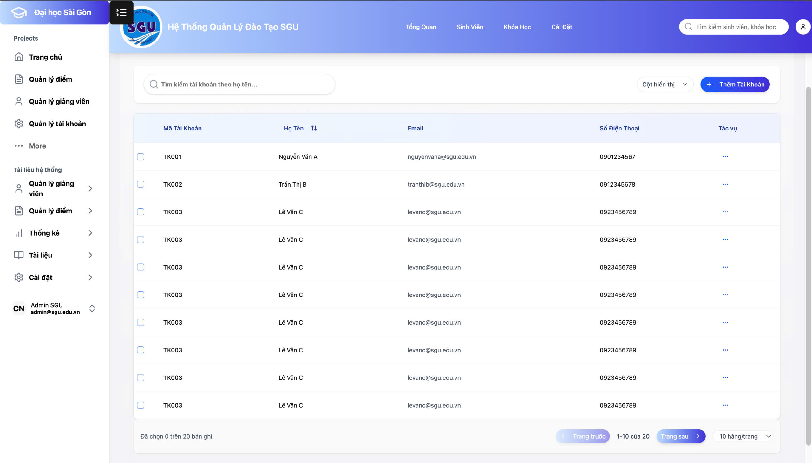

🎓 Đồ Án Xây Dựng Hệ Thống Quản Lý Giáo Dục
 
🚀 Công nghệ sử dụng:
 
🖥️ Frontend: React + Vite + TypeScript + TailwindCSS + ShadCN UI
 
🔧 Backend: Spring Boot + Maven + MySQL
 
🗂️ Mô hình kiến trúc: MVC (Model - View - Controller)
 

